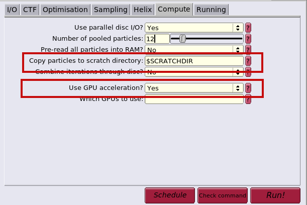
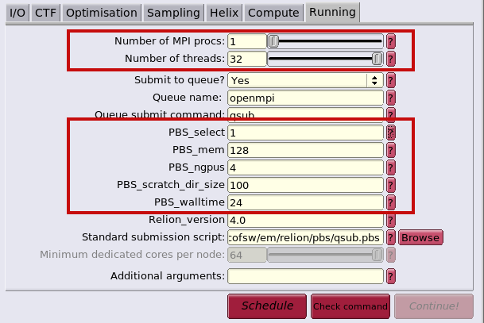

.. relion:

RELION
---------

**VERSIONS:**

* 3.1 (build date 210226)
* 4.0 (build date 211112)
* 4.0 (build date 220321)
* 3.1locsearch
* 4.0locsearch

**GENERAL INFORMATION**

RELION stands for REgularised LIkelihood OptomisatioN and it is a set of programs for refinement of cryo-electron microscopy data using empirical Bayesian approach. The program has implemented workflow for analysis of single particle data, helical processing, and sub-tomogram averiging. The program is developed and maintained in the `Sjors Scheres lab`_.

RELION local search modules (locsearch) represent custom version, see `github <https://github.com/fuzikt/relion>`_ for code details.

**USAGE SPECIFIC INFORMATION**

* to use Relion's GUI, use the following login

.. code-block:: console

   ssh -X ciisb.ceitec.muni.cz
   module add relion
   relion

* the computational tasks can be submitted to the queue directly from GUI, set ``$SCRATCHDIR`` (Fig. 1) to copy the data to the local scratch on the computational node and set the number of processes, number of threads, walltime, and number of requested GPUS

*Fig. 1: Relion GUI - set $SCRATCHDIR variable to copy data to local scratch and/or select whether to run the job on GPUs.*

*Fig. 2: Relion GUI - set requested number of MPI processes and threads. Additionally, set correct parameters for requested computational resources such as memory, number of GPUs, size of the scratch directory, and the maximal duration of the job.* 

**DEVELOPER TUTORIAL/HELP PAGES**

* documentation_
.. _Sjors Scheres lab: https://www2.mrc-lmb.cam.ac.uk/groups/scheres/
.. _documentation: https://www3.mrc-lmb.cam.ac.uk/relion/index.php?title=Download_%26_install#Getting_started
